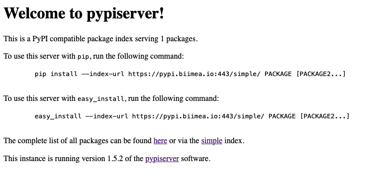

# Python private repository

This section explains how to set up the private repository for *Megamicros* software versions using the official *PyPi* container.

Add the following entry in your ``docker-compose.yml`` file:

```yaml
    ...
    pypi:
        image: pypiserver/pypiserver:latest
        container_name: pypi
        restart: unless-stopped
        volumes:
            - /data1/containers/pypi/packages:/data/packages
            - /data1/containers/pypi/auth:/data/auth
        ports:
            - 3080:8080
        command: run -P /data/auth/.htpasswd -a update /data/packages
```

The *package* directory is mounted on the server so as to ensure the data persistance.
The command line is not mandatory. Since we have to restrict the upload action (strongly recommanded), we have to tell the python *pypiserver* to process authentification.

Total control is performed by setting $a$ parameter as:

```yaml
    ...
    command: run -P /data/auth/.htpasswd -a update,list,download /data/packages
```

You can disable authentication for uploads, list and download by setting *P* and *a* otions to ``.``:

```yaml
    ...
    command: run -P . -a . /data/packages
```

Let's start the container :

```bash
    > docker compose up pypi
    ... 
    [Ctrl][C]
```

then:

```bash
    > docker compose start pypi
```

The control process is an Apache-Like authentication.
Make sure you have the passlib module installed (note that passlib>=1.6 is required), which is needed for parsing the Apache htpasswd file specified by the -P, --passwords option:

```bash
    > docker exec -it pypi pip list
```

Providing you have the ``apache2-utils`` package installed on the server, process to the ``.htpasswd`` file creation on the server:

```bash
    > htpasswd -c /data/auth/.htpasswd user1
    password1
```

Add other users if needed in the same way.

```bash
    > htpasswd -c /data/auth/.htpasswd user2
    password2
```

## Behind a proxy

Add an entry in the proxy server configuration file (nginx) to redirect requests to `your_server.io` to the server hosting the repository:

```conf
    ...
    upstream pypi{
        server pypi:8080;
    }

    location /pypi/ { 
        rewrite ^/pypi(.*) $1 break;
        proxy_set_header  X-Forwarded-Host $host:$server_port/pypi;
        proxy_set_header  X-Forwarded-Proto $scheme;
        proxy_set_header  X-Forwarded-For $proxy_add_x_forwarded_for;
        proxy_set_header  X-Real-IP $remote_addr;
        proxy_pass        http://pypi;
    }
```

In this case, requests of the form ``http://your_server/pypi/*`` will be redirected to your docker server as ``http://your_server/*``.
If the pypi server serves on ``/`` end-point:

```conf
    ...
    upstream pypi{
        server pypi:8080;
    }

    location /pypi/ { 
        proxy_set_header  X-Forwarded-Host $host:$server_port;
        proxy_set_header  X-Forwarded-Proto $scheme;
        proxy_set_header  X-Forwarded-For $proxy_add_x_forwarded_for;
        proxy_set_header  X-Real-IP $remote_addr;
        proxy_pass        http://pypi;
    }
```

Here is a full example of *nginx* configuration file for requests on ``pypi.biimea.io`` with *ssl* support:

```bash

server {
    listen 80;
    listen [::]:80;

    server_name pypi.biimea.io;
    server_tokens off;

    location /.well-known/acme-challenge/ {
        root /var/www/certbot;
    }

    location / {
        return 301 https://pypi.biimea.io$request_uri;
    }
}

server {
    listen 443 ssl http2;
    listen [::]:443 ssl http2;

    server_name pypi.biimea.io;

    ssl_certificate /etc/nginx/ssl/live/pypi.biimea.io/fullchain.pem;
    ssl_certificate_key /etc/nginx/ssl/live/pypi.biimea.io/privkey.pem;

    # please renew the certificates by typing the renew command:
    # > docker compose run --rm certbot renew
    # see https://mindsers.blog/post/https-using-nginx-certbot-docker/

    location / {
        proxy_set_header  X-Forwarded-Host $host:$server_port;
        proxy_set_header  X-Forwarded-Proto $scheme;
        proxy_set_header  X-Forwarded-For $proxy_add_x_forwarded_for;
        proxy_set_header  X-Real-IP $remote_addr;
        proxy_pass        http://pypi;
    }

    #error_page  404              /404.html;

    # redirect server error pages to the static page /50x.html
    #
    error_page   500 502 503 504  /50x.html;
    location = /50x.html {
        root   /usr/share/nginx/html;
    }
}
```

For python software packaging, see the [Megamicros Packaging](python_package.md) section.

## Tests

By typing the server address in a browser you should get the following root page:



After having uploaded a megamicros package, try to search it on the repository:

```bash
    > pip search --index https://pypi.biimea.io megamicros
    megamicros (2.0.6)  - 2.0.6
```

For package installation:

```bash
    > pip install --index https://pypi.biimea.io megamicros
    Looking in indexes: https://pypi.biimea.io
    Collecting megamicros
        Downloading https://pypi.biimea.io:443/packages/megamicros-2.0.6.tar.gz (19 kB)
        Installing build dependencies ... done
        ...
```

You may want to not write systematically the repository address.
Always specifying the pypi url on the command line is a bit cumbersome.
For pip command this can be done by setting the environment variable ``PIP_EXTRA_INDEX_URL`` in your ``.bashr/.profile/.zshrc/.zprofile``:

```bash
    export PIP_EXTRA_INDEX_URL=https://pypi.biimea.io
```

or by adding the following lines to ``~/.pip/pip.conf``:

```bash
    [global] extra-index-url = https://pypi.biimea.io
```

## Documentation

* [Hosting your own simple repository](https://packaging.python.org/en/latest/guides/hosting-your-own-index/)
* [How to create a python private package repository](https://www.linode.com/docs/guides/how-to-create-a-private-python-package-repository/)
* [Pypiserver](https://pypi.org/project/pypiserver/)
* [Docker-container install documentation](https://hub.docker.com/r/pypiserver/pypiserver)
* [Restricting Access with HTTP Basic Authentication](https://docs.nginx.com/nginx/admin-guide/security-controls/configuring-http-basic-authentication/)
* [Docker compose file examples](https://github.com/pypiserver/pypiserver/blob/master/docker-compose.yml)
* [Manage your Python Packages Workflow](https://www.devpi.net/)
