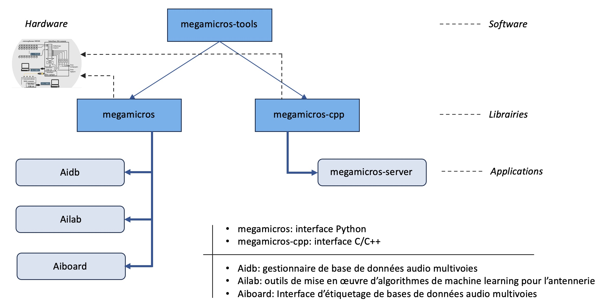

# Welcome to the Megamicros documentation

* [Tutorials](tutorials/index.md)
* [APIs](api/index.md)
* [Dev](dev/index.md)

"Megamicros-tools is a library of software tools dedicated to the operation of miniature digital microphone antennas (MEMs).  These antennas operate with an electronic circuit for acquiring audio signals, called a "synchronous concentrator" and developed at the Institut Jean Lerond d'Alembert of Sorbonne University under the name "Megamicros".

The software package consists of two parts:

* Two libraries providing the acquisition system interface in Python and C++
    * Megamicros: acquisition interface written in Python
    * Megamicros-cpp: acquisition interface written in C++.
* 4 software bricks to exploit the acquisition system via its access libraries to build AI systems for the recognition and spatial localization of sound sources. 
    * Megamicros-server: acquisition server for connected antennas
    * Aidb: multichannel audio database manager for machine learning
    * Ailab: Tools for implementing machine-learning algorithms for microphone antennas
    * Aiboard: Web interface for labeling multichannel audio databases

<figure markdown>
  { width="800" }
  <figcaption>Megamicros resources overview</figcaption>
</figure>

## Megamicros

"Megamicros" is a library written in Python, enabling Python programs to be interfaced with the low-level USB bus calls of the "libusb" library, which is itself a wrapper for the "Libusb" C library. The "megamicros" library integrates all the commands needed to drive Megamicros 32, 256 and 1024 antennas. The synchronous concentrators associated with these different antennas are equipped with one or more FPGA circuits, which can be controlled via the library.
The library also incorporates algorithms for beamforming antenna processing.  A simulation software layer enables antenna emulation, so that processing can be tested without the need for physical antennas. Finally, another layer enables connection to remote antennas via the websockets protocol.

## Megamicros-cpp

C library for interfacing programs written in C/C++ with the low-level USB bus calls of the "Libusb" C library. This library plays the same role as the "megamicros" python library for programs written in C/C++.

## Megamicros-server

This is an application written in C++, using the "megamicros-cpp" library, which implements a server to make data generated by Megamicros antennas available on the Internet. The server allows users of the above Megamicros library to connect and work on the antenna as if it were present locally. The server also communicates in the form of MQTT messages and accepts connections to MQTT servers, effectively transforming the antenna into an MQTT-compatible connected object.

## Aidb

"Aidb" groups together the code needed to build REST-type databases adapted to multi-channel audio signals. This software layer incorporates the components needed to emulate the antennas that produced the recorded sound files. Users of the "Megamicros" library above can therefore work with fictitious antennas, or at least as they existed when they produced the signals. It is written on the "Django" and "Django Rest Framework" python platforms.

## Aiboard

"Aiboard is a tool written in Python on the Dash Framework, providing graphical access to databases built via Aidb and an Internet browser. This tool enables databases to be labeled for use in machine learning: listening to signals, estimating particular indices, selecting and visualizing spectra, defining labels and labeling signals.

## Ailab

"Ailab" brings together all the AI software for multichannel signal processing. This component is not yet written.