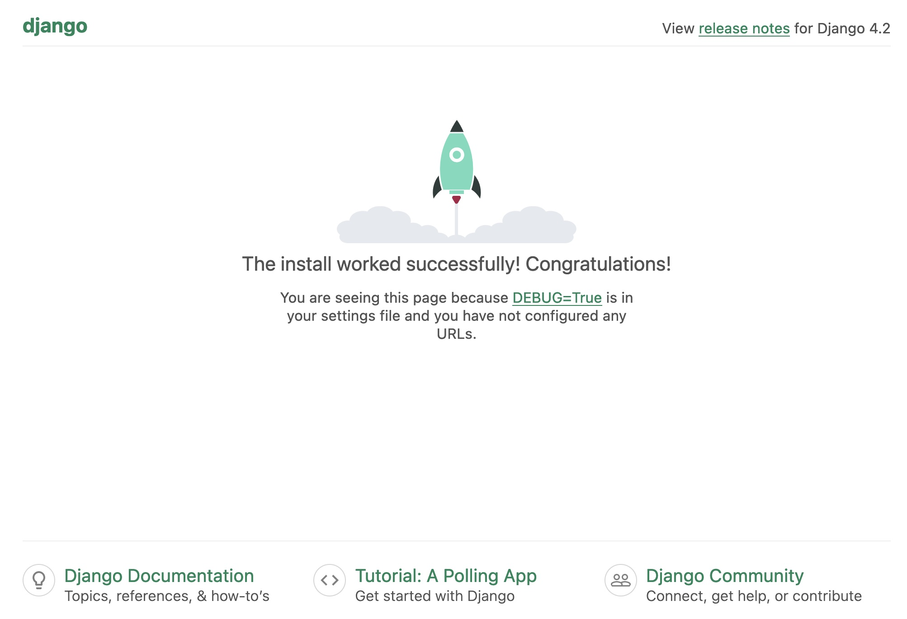

# Database for microphones array data

This tutorial aims at defining the way you can save your data by using the *django Rest framework* for database building.

## Installing  *Aidb*

*Aidb* designates the database model used for saving signals from MegaMicro antennas.
The database operates in remote server mode with a REST interface for managing requests.

Sources are available on Github at [GitHub bimea/megamicros](https://github.com/bimea/megamicros).
Several installation methods are possible:

* Direct installation mode
* Docker container mode

### The direct installation mode (MacOs and Linux systems)

Again two installation modes are possible.
One from the *megamicros* GitHub repository (for developpers) and the other using *pip install* (for end users).

#### Using *pip install*

* create a python virtual environment with *Megamicros*, *Django* and *Djang-Rest-Framework* installed, and also some required Python modules:

```bash
    $ > mkdir project && cd project
    $ > virtualenv venv
    $ > source venv/bin/activate
    (venv) $ > export PIP_EXTRA_INDEX_URL=https://pypi.biimea.io
    (venv) $ > pip install megamicros  
    (venv) $ > pip install django djangorestframework djangorestframework-simplejwt django-cors-headers django-filter dj-rest-auth
    (venv) $ > pip install ffmpeg h5py paho_mqtt
```

* Build a new *Django* project

```bash
    (venv) $ > django-admin startproject my_project_name
    (venv) $ > cd my_project_name
    (venv) $ > python manage.py migrate
    Operations to perform:
        Apply all migrations: admin, auth, contenttypes, sessions
    Running migrations:
        Applying contenttypes.0001_initial... OK
        Applying auth.0001_initial... OK
        Applying admin.0001_initial... OK
        Applying admin.0002_logentry_remove_auto_add... OK
        Applying admin.0003_logentry_add_action_flag_choices... OK
        Applying contenttypes.0002_remove_content_type_name... OK
        Applying auth.0002_alter_permission_name_max_length... OK
        Applying auth.0003_alter_user_email_max_length... OK
        Applying auth.0004_alter_user_username_opts... OK
        Applying auth.0005_alter_user_last_login_null... OK
        Applying auth.0006_require_contenttypes_0002... OK
        Applying auth.0007_alter_validators_add_error_messages... OK
        Applying auth.0008_alter_user_username_max_length... OK
        Applying auth.0009_alter_user_last_name_max_length... OK
        Applying auth.0010_alter_group_name_max_length... OK
        Applying auth.0011_update_proxy_permissions... OK
        Applying auth.0012_alter_user_first_name_max_length... OK
        Applying sessions.0001_initial... OK
    (venv) $ > python manage.py createsuperuser --email <your_email> --username admin
    Password:
    Password (again):
    Superuser created successfully.
```

* Test your *Django server* by typing the following run command and by looking at your web browser:

```bash
    (venv) $ > python manage.py runserver
```

You should see something like that as the home django start page:



You have now to install the *Django Rest Framework* and the *megamicros.aidb* applications.
This is done by updating the default ``settings.py`` file in the ``my_project_name/my_prject_name`` directory.
Add the follong lines :

```python
    #...
    # Add the following applications
    INSTALLED_APPS = [
        ...,                        # already installed apps
        'django_filters',           # DRF apps and misc
        'rest_framework',           # ...
        'rest_framework.authtoken',
        'corsheaders',  
        'dj_rest_auth',
        'megamicros.aidb'           # the megamicros app
    ]
```

Also the ``ROOT_URLCONF`` should be updated to link to the *Megamicros* application pages:

```python
    #...
    ROOT_URLCONF = 'megamicros.aidb.urls'
```

Add the following lines for DRF application:

```python
    # ...
    # REST Framework parameters
    REST_FRAMEWORK = {
        #'DEFAULT_PAGINATION_CLASS': 'rest_framework.pagination.PageNumberPagination',
        'DEFAULT_PAGINATION_CLASS': 'rest_framework.pagination.LimitOffsetPagination',
        'PAGE_SIZE': 20,
        #'DATE_INPUT_FORMATS': ['%Y-%m-%d %H:%M:%S.%f', 'iso-8601'],
        'DEFAULT_AUTHENTICATION_CLASSES': (
            'rest_framework.authentication.SessionAuthentication',
            'rest_framework.authentication.TokenAuthentication',
            #'dj_rest_auth.jwt_auth.JWTCookieAuthentication'
        ),
        #'DEFAULT_SCHEMA_CLASS': 'rest_framework.schemas.coreapi.AutoSchema'
    }

    SWAGGER_SETTINGS = {
        'LOGIN_URL': 'login',
        'LOGOUT_URL': 'logout',
    }
```

Set the following *Megamicros* application parameters:

```python
    # ...
    CORS_ALLOW_ALL_ORIGINS: True
    ALLOWED_HOSTS = ['localhost', '127.0.0.1']

    # MQTT parameters that should be updated to local usage
    MEGAMICROS = {
        'MQTT_BROKER_HOST': 'parisparc.biimea.tech',
        'MQTT_BROKER_PORT': 1883,
        'MQTT_CLIENT_ID': 'megamicros/aidb/unknown',
        'MQTT_LOG_TOPIC': 'megamicros/aidb/unknown/log',
        'MQTT_LOG_QOS': 1,
    }
```

Last thing is to make migrations in the database for building the new tables of the two applications *DRF* and *Megamicros*:

```bash
    (venv) $ > python manage.py migrate
    Operations to perform:
        Apply all migrations: admin, auth, authtoken, contenttypes, sessions
    Running migrations:
        Applying authtoken.0001_initial... OK
        Applying authtoken.0002_auto_20160226_1747... OK
        Applying authtoken.0003_tokenproxy... OK
    (venv) $ > python manage.py makemigrations aidb
    Migrations for 'aidb':
        /Users/brunogas/Documents/Dev/Bimea/venv/lib/python3.10/site-packages/megamicros/aidb/migrations/0001_initial.py
            - Create model Campaign
            - Create model Config
            - Create model Context
            - Create model Device
            ...
    (venv) $ > python manage.py migrate
    Operations to perform:
        Apply all migrations: admin, aidb, auth, authtoken, contenttypes, sessions
    Running migrations:
        Applying aidb.0001_initial... OK
```

Run the server:

```bash
    (venv) $ > python manage.py runserver
```

Your database is now ready for use.

!!! Warning
    Note that for some reasons, hdf5 (version 1.12) does not work with Mac M2 processor. 
    Instead Install the 1.8 version:

```bash
    $ > brew install hdf5@1.8
    $ > export HDF5_DIR=/opt/homebrew/opt/hdf5@1.8
    $ > pip install h5py
```

!!! warning
    Note that for other reasons hdf5 may not work on Mac Os with Python 3.11 (whatever the version you want to install 1.8, 1.10  or 1.12).
    Please install Python 3.10 for the hdf5 library to work fine.

### In a container for docker environments

An instance of the repository is the implementation of a production version of the application: its containerization and then its execution. 
Some instance-specific configuration items need to be added to the configuration file.

The container image contains the platform needed to run the application, without the application itself:

#### Image dockerfile

[See the Dockerfile file](./files/Dockerfile)

```yaml
   # Dockerfile for biimea/aidb:python3.10-drf3.14.0 image build
   # Version: 1.1 - 20221220 

    FROM ubuntu:22.04

    LABEL author=bruno.gas@biimea.com
    LABEL vendor=biimea
    LABEL version=1.1

    # needed for dpkg-reconfigure to be in non interactive mode:
    ARG DEBIAN_FRONTEND=noninteractive

    RUN apt update
    RUN apt full-upgrade -y

    RUN apt install -y git \
        openssh-client \
        vim \
        tzdata \
        libhdf5-dev \
        ffmpeg 

    # For 'default timezone' reconfiguring:
    RUN ln -fs /usr/share/zoneinfo/Europe/Paris /etc/localtime
    RUN dpkg-reconfigure -f noninteractive tzdata

    RUN apt install -y python3 \
        python3-distutils \
        python3-dev \
        python3-venv \
        python3-pip
        
    RUN ln -fs /usr/bin/python3 /usr/bin/python

    RUN python -m pip install --upgrade pip

    RUN pip install django \
        djangorestframework \
        djangorestframework-simplejwt \
        django-cors-headers \
        django-filter \
        dj-rest-auth \
        h5py \
        ffmpeg-python \
        paho-mqtt

    RUN mkdir -p /app
    RUN mkdir /.ssh
    RUN mkdir /data1 && mkdir /data2 && mkdir /data3
    RUN mkdir /base1 && mkdir /base2 && mkdir /base3
    RUN rm -rf /root/.ssh && ln -s /.ssh /root/.ssh

    COPY docker-entrypoint.sh /
    RUN chmod 755 /docker-entrypoint.sh

    WORKDIR /app

    EXPOSE 8000

    ENTRYPOINT ["/docker-entrypoint.sh"]
```

#### Volumes

The container has 8 volumes in its file system named */app, /.ssh, /data1, /data2, /data3, base1, /base2, /base3*.

* ``/app`` is the directory containing the application and its configuration files as well as the *sqlite* database provided it is used;
* ``/.ssh`` is the directory that contains the private and public key to download the application (and update it) from the *Github* repository;
* ``/data1`` to ``/data3`` allow to make mount points with disks containing data sources;
* ``/base1`` to ``/base3`` make it possible to make mount points with disks containing databases made from sources.


!!! Important

    Mounting the */app* directory is not mandatory if the database is outside the container (*dbmysql*, *mariadb*, *postgres*, …), but it is strongly recommanded for internal database (*sqlite*) since this is the only way to preserve data in crash case.

The [docker-entrypoint.sh](files/docker-entrypoint.sh) file get the application source code by cloning the repository. 
It updates it each time the container is restarted:

#### Start script

```bash

    #!/bin/sh
    # docker-entrypint.sh for for biimea/aidb:python3.10-drf3.14.0 image build
    # version 1.1 - 20221220 

    if [ ! -d /app/Aidb ] ; then
        echo "This is a first installation: cloning Aidb repository..."
        cd /app
        git clone git@github.com:biimea/Aidb.git
        cd Aidb/aidb
        python manage.py makemigrations
        python manage.py migrate
        python manage.py createsuperuser --noinput
        cd aidb
        echo "ALLOWED_HOSTS = ['${ALLOWED_HOSTS}']" >> settings.py
        cp settings.py settings.template.py
        echo "done"
    else
        echo "Project already installed, updating from Aidb repository..."
        cd /app/Aidb
        git pull
        cd aidb
        python manage.py makemigrations
        python manage.py migrate
        echo "done"
    fi

    echo "exec Biimea-Aidb..."
    exec python /app/Aidb/aidb/manage.py runserver 0.0.0.0:8000
```

#### Docker-compose 

```yaml
    version: '3.3'

    services:
        aidb:
            image: biimea/aidb:python3.10-drf3.14.0
            container_name: aidb
            restart: unless-stopped
            volumes:
                - aidb_disk2:/data2
                - aidb_disk3:/data3
                - aidb_base1:/base1
                - aidb_base2:/base2
                - ssh-key:/.ssh
                - aidb_app:/app
            ports:
                - 2080:8000
            environment:
                - ALLOWED_HOSTS=dbwelfare.biimea.io
                - DJANGO_SUPERUSER_USERNAME=admin
                - DJANGO_SUPERUSER_PASSWORD=*******
                - DJANGO_SUPERUSER_EMAIL=bruno.gas@beamea.com

    volumes:
        aidb_disk2:
            external: true
        aidb_disk3:
            external: true
        aidb_base1:
            external: true
        aidb_base2:
            external: true
        ssh-key:
            external: true
        aidb_app:
            external: true
```

## Configuring a domain database


*Aidb* lets you build many databases for several applications. 
Each application is defined as a *domain* that can be declared with the following entry:

```bash
    Domain:
        - name
```

A *campaign* is a set of data that have been collected in similar conditions (same place and same date for example):

```bash
    Campaign:
        - domain
        - name
        - date
```

A *Device* is the name and the identifier of the acquisition system used for a given campaign. *Device* entry is:

```bash
    Device:
        - type
        - name
        - identifier
```

The directory the data files are stored in is set using the *Directory* entry:

```bash
    Directory:
        - name
        - absolute path
        - campaign
        - device
```

## Générer un dataset

Un *dataset* désigne une base de donnée de signaux exploitables pour la réalisation d'apprentissages machine. 
*Aidb* n'enregistre pas les datasets sur disque. Ils sont générés à la volée sur requête des utilisateurs.
La génération d'un dataset s'effectue en plusieurs temps:

* Création du dataset (``[POST]/dataset``);
* Téléchargement du dataset (``[GET]/dataset/<id_dataset>/upload``);
* Sauvegarde du dataset (``[PUT]/dataset/<id_dataset>/save``).

La création d'un dataset s'effectue à partir des labels et des contextes définis sur les enregistrements de la base de donnée au moment de la définition.
Le résultat peut donc être différent selon que la labellisation et/ou la contextualisation de la base a changé ou pas entre deux requêtes.
Afin de conserver une structure stable des datasets créés, c'est à dire de pouvoir télécharger un dataset déjà créé sans qu'il soit modifié, les deux opérations de création et de téléchargement sont séparées.
Un dataset est créé une fois, et téléchargé autant de fois que désiré.
Si l'étiquetage de la base de donnée est modifié, le dataset peut être régénéré en en créant un nouveau, puis en le téléchargeant.
En conséquence de tout ceci, un dataset n'est pas modifiable (l'opération ``[PUT]/dataset/<id_dataset>`` n'est pas acceptée).

La requête de création d'un dataset doit comporter tous les paramètres nécéssaires à sa création:

```json
    {
        "name": "dataset name",
        "code": "dataset code",
        "domain": "data domain",
        "labels": [
            "label1", "label2", "label...N"
        ],
        "contexts": [
            "ctx1", "ctx2", "ctx...N"
        ],
        "channels": [0, 1, 2, 3, 4, 5, 6, 7],
        "tags": [
            "tag1", "tag2", "tagN"
        ],
        "comment": "comment",
        "info": {
            "info1", "info...", "infoN"
        }
    }
```

Mais l'enregistrement d'un *dataset* dans la base de donnée comporte des champs supplémentaires cachés:

```json
    {
        "samples": [10, 11, 12],
        "crdate": "date",                 
        "filename": "filename"              
    }
```

* ``samples``: liste des identifiants des segments labelisés au format Json
* ``crdate``: date de création du dataset
* ``filename``: nom du fichier de sauvegarde

La requête de téléchargement ``[GET]/dataset/<id_dataset>/upload`` génère la base de donnée sous la forme d'un fichier ``.h5`` avant sa transmission.
Comme précisé plus haut (requête ``save``), il est possible de réaliser la sauvegarde d'un dataset sur le serveur pour éviter sa regénération à chaque requête de téléchargement.
Une fois la sauvegarde réalisée, le champ ``filename`` de l'enregistrement du dataset est complété.  

Pour détruire cette sauvegarde:

* ``[PUT]/dataset/<id_dataset>/delete``

A ne pas confondre avec la supressionn complete du dataset:

* ``[DELETE]/dataset/<id_dataset>``


