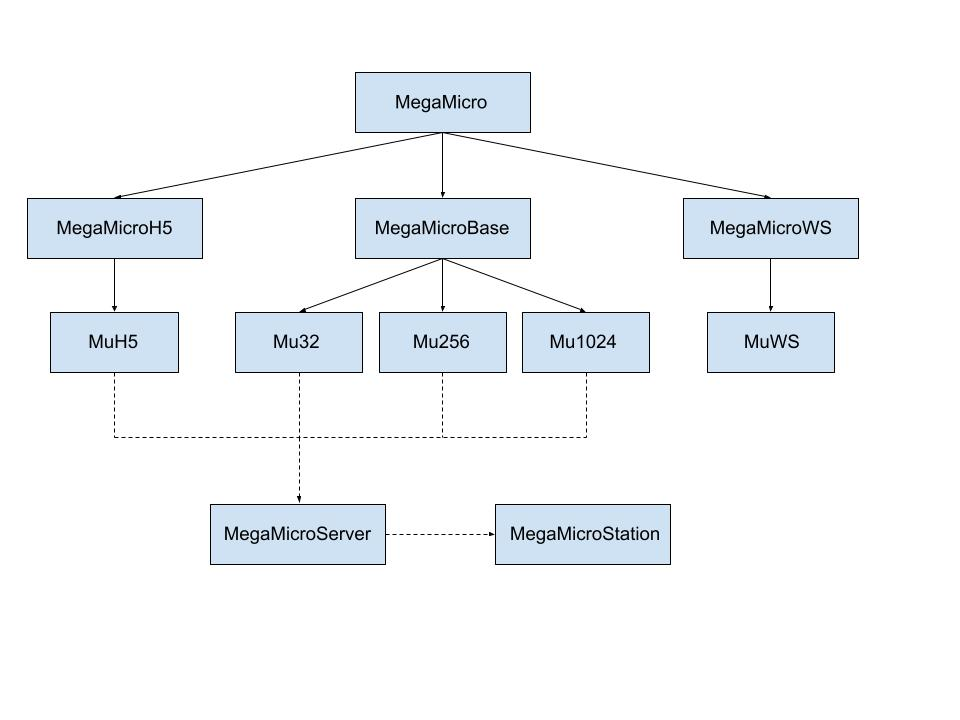

# The C++ Megamicros library

The *Megamicros-c++* library has been designed for very specific usages such as installing a server for sending audio or high level data coming from a microphone array through the network.

The library is build over the *libusb 1.0* library.

## Dependencies

The *Megamicros-c++* library needs other third party libraries to work:

* The cmake and pkg-config utilities
* The libusb 1.0.26 for USB connecting
* The websocketpp library for sending data through the web
* The nlohmann/json C++ library for json file writing/reading
* The C and C++ client library for MQTT publishing/subscribing client design
* The FFTW C/C++ library for Discrete Fourier Transform computing
* The hdf5 C/C++ library for H5 file handling

All these libraries are installed at compile time by the cmake utility except the hdf5 library.
The HDF5 library could be installed using cmake but this is time consuming.  
Therefore, there is nothing to do before the installation, except to get Megamicros and cmake, install hdf5, and run cmake.

## Install dependencies on Mac Os

Install the *cmake* and the *pkg-config* utilitary and *openssl* (needed by *cmake*):

```bash
  $ > brew install cmake pkg-config openssl hdf5
```

For pkg-config to find openssl@3 you may need to set:

```bash
  $ > export PKG_CONFIG_PATH="/usr/local/opt/openssl@3/lib/pkgconfig"
  $ > pkg-config --modversion openssl
  3.1.0
```

Or even directly in your `.zprofile` file:

```bash
  $ > echo 'export PKG_CONFIG_PATH="/usr/local/opt/openssl@3/lib/pkgconfig"' >> ~/.zshrc
```

## Install dependencies on Linux systems

Note that *libudev-dev* (API for enumerating and introspecting local devices) should be installed.

```bash
  $ > sudo apt install cmake pkg-config libssl-dev libudev-dev libhdf5-dev
  $ > pkg-config --modversion openssl
  3.0.2
```

## Installing libusb and/or websocketpp

You may want to install *libusb* and/or *websocketpp* on your own, although this is not necessary.
On Mac Os:

```bash
$ > brew install libusb websocketpp
```

On linux systems (Ubuntu). Note that the *boost* package may be needed for websocketpp to work:

```bash
$ > sudo apt install libusb-1.0-0 libusb-1.0-0-dev libwebsocketpp-dev libboost-all-dev
```

Have a look at library packages by listing them:

```bash
$ > pkg-config --list-all
```

On Mac OS:

```bash
$ > brew list
```

!!! warning

    Concerning websocketpp install on MacOs systems, hdf5@1.8 is keg-only, which means it was not symlinked into /opt/homebrew,
    because this is an alternate version of another formula.

    If you need to have hdf5@1.8 first in your PATH, run:

    ```bash
    $ > echo 'export PATH="/opt/homebrew/opt/hdf5@1.8/bin:$PATH"' >> ~/.zshrc
    ```

    For compilers to find hdf5@1.8 you may need to set:

    ```bash
        $ > export LDFLAGS="-L/opt/homebrew/opt/hdf5@1.8/lib"
        $ > export CPPFLAGS="-I/opt/homebrew/opt/hdf5@1.8/include"
    ```

!!! note

    The compiler may not find some include files. 
    In this case, check that your include files are in ``/usr/local/include``. 
    This is the root include directory which is defined in the default include path variable of cmake.
    If this is not the case, you can either change the cmake include path variable accordingly or add a link as below:

    ```bash
        sudo ln -s /opt/homebrew/include /usr/local/include
    ```

## Compiling


Clone the *Megamicros_cpp* GitLab repository and run the *cmake* utility in a `./build` directory:

```bash
  $ > git clone ...Megamicros_cpp
  $ > cd Megamicros_cpp
  $ > mkdir build
  $ > cd build
  $ > cmake ..
  $ > make
```

Here are some directives for code compiling.
There are four build types :

  * **Debug**: Fast compilation times, no optimization, debugging symbols are maintained.
  * **Release**: Compiles with a high level of optimization. Prioritizes runtime performance over compilation time.
  * **RelWithDebugInfo**: Compiles with a good level of optimization, debugging symbols are maintained.
  * **MinSizeRel**: Compiles with optimization that prioritizes executable file size and speed over compilation time.

The default build type is set to **Release**. 
In development mode, you can build the project with a more appropriate build type:

```bash
  $ > cd build
  $ > cmake -D CMAKE_BUILD_TYPE=Debug ..
  $ > make
```

Also you can get some informations about the compilation parameters by using the **ccmake** command (set the Toggle advanced mode ON (currently off)):

```bash
  $ >  cd build
  $ > ccmake .
```
Another usefull command for getting informations:

```bash
  $ > cd build
  $ > cmake --system-information information.txt
  $ > vi information.txt
```

!!! Failure "Failure: make crashes"

    On linux systems, *make* can crash with the following message:

    ```bash
    $ > cmake ..
    $ > make
    ...
    [ 95%] Linking CXX shared library libmegamicros.so
    /usr/bin/ld: ../_deps/libusb-build/libusb-1.0.a(threads_posix.c.o): relocation R_X86_64_TPOFF32 against `tl_tid.2' can not be used when making a shared object; recompile with -fPIC
    /usr/bin/ld: failed to set dynamic section sizes: bad value
    collect2: error: ld returned 1 exit status
    make[2]: *** [src/CMakeFiles/megamicros.dir/build.make:196: src/libmegamicros.so] Error 1
    make[1]: *** [CMakeFiles/Makefile2:1019: src/CMakeFiles/megamicros.dir/all] Error 2
    make: *** [Makefile:166: all] Error 2
    ```

    This is because libusb is a static library while we are building a Megamicros shared library. 
    CMake does not set the -fpic option when building static libraries. One can force by using the `DCMAKE_POSITION_INDEPENDENT_CODE` option:
    
    ```bash 
    $ > cmake -DCMAKE_POSITION_INDEPENDENT_CODE=ON ..
    $ > make
    ...
    ```

## Installaing

The shortest way is:

```bash
  $ > make install
```

All binaries will be installed in `/usr/local` by default.

## Testing

Some programms are available which should help you to test the library:

* `Megamicros-check-usb`: for USB connection checking
* `Megamicros-check`: for Megamicros device checking
* `Megamicros-mbs-server`: the Megamicros broadcast server for networking 

## Programm example

You can write C++ programs using the Megamicro C++ library.
In the very simple example bellow, you activate all MEMs and analogic channels for getting a one second signal at 50kHz (this is the default).
The mode is `asynchronous`, meaning that you have to explicitly wait for the end of the process which is running in another thread.

```cpp

  #include <iostream>
  #include <string>
  
  #include <megamicros_usb.hpp>

  // your callback prototype
  int your_callback( void *buffer, int buffer_size, void* args );


  int main() {
    MegamicrosUSB megamicros;

    megamicros.mems( "all" );
    megamicros.analogs( "all" );
    megamicros.duration( 1 );
    megamicros.async( true );
    megamicros.transfer_callback( your_callback, (void *) &megamicros );
    
    megamicros.run();
    megamicros.wait();
  }

  // your callback function for data processing
  int your_callback( void *buffer, int buffer_size, void* args ) {
    MegamicrosUSB &megamicros = *( (MegamicrosUSB *) args );
    static int transfer_i = 0;

    // do what you want with data comming from the Megamicros device
    // ... 

    return 0;
  }
```

The `synchronous` mode implies that the acquisition process is running in the main thread. The call to the `run()` method would become a blocking call.
More settings are available like those:

```cpp

  #include <iostream>
  #include <string>
  
  #include <megamicros_usb.hpp>

  // your callback prototype
  int your_callback( void *buffer, int buffer_size, void* args );

  int main() {
    MegamicrosUSB megamicros;

    megamicros.mems( "all" );                     // Activate all MEMs
    megamicros.analogs( "all" );                  // Activate all analogical channels
    megamicros.counter( true );                   // Activate counter
    megamicros.counter_skip( false );             // Get Counter signal
    megamicros.status( true );                    // Activate and get status signal
    megamicros.clockdiv( 9 );                     // Set smapling frequency to 50kHz
    megamicros.transfer_timeout( 100 );           // Set timeout to 100ms (the delay after what the system throws an exception)
    megamicros.duration( 1 );                     // Acquisition duration (0 means infinite loop acquisition)
    megamicros.async( true );                     // Set the asynchronous mode
    megamicros.mems_init_wait( 0 );               // Waiting delay after MEMs are powered on 
    megamicros.completion_threshold( 100 );       // threshold in percentage of the number of full buffers before launching an alarm  
    megamicros.transfer_callback( your_callback, (void *) &megamicros );
    
    megamicros.run();
    megamicros.wait();
  }

  // your callback function for data processing
  //...
```

Have a look at the `apps` directory of the project for more examples. 


## Annexe

### See also

  * [Megamicros Broadcast Server](../mu-server)
  * [Python programming for MBS](../python/megamicros-ws/)

### Cmake architecture

```bash
  Megamicros_cpp
  |----- CMakeLists.txt
  |----- src
          |---- CMakeLists.txt
          |---- lib_sources_codes.cpp
          |---- lib_sources_headers.hpp
          |---- ...
  |----- tests
          |---- CMakeLists.txt
          |---- test_xxx.cc
          |---- test_yyy.cc
  |----- apps
          |---- CMakeLists.txt
          |---- program1.cc
          |---- program2.cc
          |---- ...
          |---- mbs-server
                  |---- CMakeLists.txt
                  |---- src
                          |---- CMakeLists.txt
                          |---- sources.cc
                          |---- sources.hpp
                          |---- ...
          |---- mbs-tracker                          
                  |---- src
                          |---- CMakeLists.txt
                          |---- sources.cc
                          |---- sources.hpp
                          |---- ...
  |----- build 
```

<figure markdown>
  { width="800" }
  <figcaption>Class hierarchy</figcaption>
</figure>


## Bibliography

* [CMake Tutorial](https://tutos.metz.centralesupelec.fr/TPs/TP-CMake/)
* [The libusb 1.0.26 library](https://libusb.sourceforge.io/api-1.0/)
* [Websocket++](https://github.com/zaphoyd/websocketpp) [(Web site)](http://www.zaphoyd.com/websocketpp/) [(User manual)](http://docs.websocketpp.org/)
* [Json for modern C++](https://github.com/nlohmann/json/)
* [Eclipse Paho C Client Library for the MQTT Protocol](https://github.com/eclipse/paho.mqtt.c)
* [Eclipse Paho MQTT C++ Client Library](https://github.com/eclipse/paho.mqtt.cpp)
* [FFTW](http://www.fftw.org/)